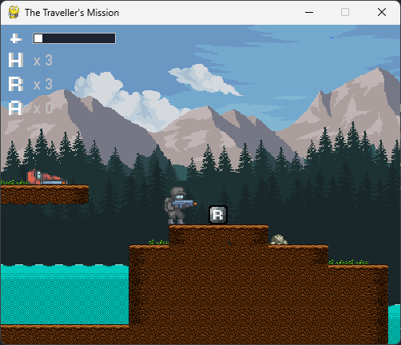
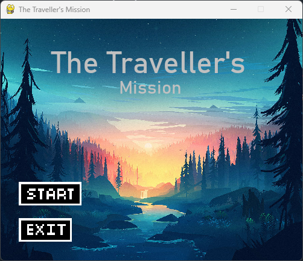
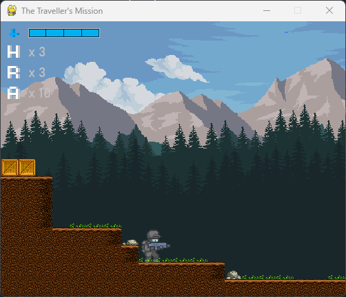
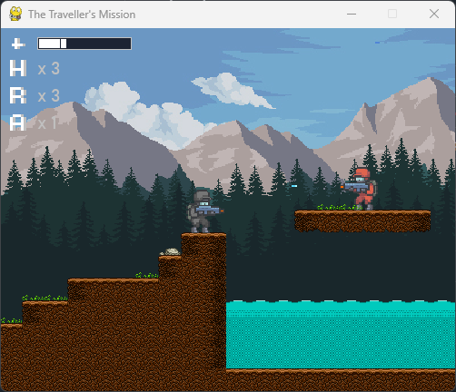
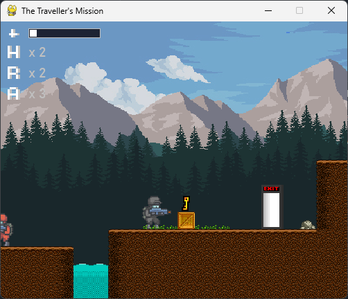

# The Traveller's Mission

**The Traveller's Mission** is a 2D side-scrolling shooter built with **Python** and **Pygame**.  
The player moves through a tile-based level, avoids hazards, collects items, fights enemies, and tries to reach the exit.

I originally built this project on Replit, then later migrated it into a cleaner local Python project with a more maintainable structure, dependency management, and organised assets.

 

---

## Why I Built This

I built this project to practise applying Python beyond small scripts and exercises.  
The goal was to create a complete playable game with movement, animation, collision detection, enemy behaviour, UI elements, and level data loaded from files.

This project helped me strengthen my understanding of:

- object-oriented programming in Python
- game loops and real-time input handling
- sprite-based animation
- collision detection
- basic enemy AI logic
- reading external level data from CSV files
- organising a larger Python project
- migrating a cloud/Replit project into a local development setup

---

## Features

- 2D side-scrolling platformer/shooter gameplay
- Player movement, jumping, shooting, reloading, and healing
- Enemy patrol behaviour with vision detection
- Bullet collision with enemies, player, and world tiles
- Health, shield, ammo, reload, and healing UI
- Collectable items including reload boxes and keys
- Tile-based level loading from CSV files
- Animated player and enemy sprites
- Title screen and menu buttons
- Local Python/Pygame setup with `requirements.txt`

---

## Screenshots

### Title Screen



### Gameplay






---

## Controls

| Key | Action |
|---|---|
| `A` | Move left |
| `D` | Move right |
| `W` | Jump |
| `Space` | Shoot |
| `R` | Reload |
| `F` | Heal |

---

## Technical Overview

The game is structured around Pygame sprites and a main game loop.

Key parts of the implementation include:

- **`Soldier` class**: handles player and enemy movement, animation, health, shield, shooting, and death states.
- **`World` class**: processes CSV level data and generates terrain, obstacles, enemies, pickups, water, decoration, and exits.
- **Sprite groups**: used to manage bullets, enemies, items, water, decoration, and exits.
- **CSV level loading**: allows the level layout to be edited independently from the main Python code.
- **Collision detection**: used for world tiles, bullets, pickups, water hazards, and player/enemy interactions.
- **UI drawing**: displays player health, shield, ammo, reloads, and healing items.

---

## What I Learnt

This project gave me practical experience building a larger Python program with multiple interacting systems rather than isolated functions.

The main things I learnt were:

- how to structure a real-time game loop
- how to use classes to model game entities
- how to manage state for movement, jumping, shooting, animation, and death
- how to use sprite groups to organise active game objects
- how to debug collision and scrolling issues
- how to load and interpret external data files
- how to separate game assets, source code, and level data more cleanly
- how to migrate an older Replit project into a local VS Code/GitHub workflow

This migration also helped me understand Python virtual environments, dependency management, interpreter versions, and why project structure matters when making a repository easier for others to run.

---

## Project Structure

```text
travellers-mission/
├── assets/
│   ├── fonts/
│   ├── img/
│   └── levels/
├── src/
│   ├── main.py
│   └── button.py
├── requirements.txt
├── README.md
└── .gitignore
```

---

## Game

### [Play the game here!](https://the-travellers-mission--mateuszstepien1.replit.app/)

> [!NOTE]
> This is an old link that is no longer active since the migration from Replit.